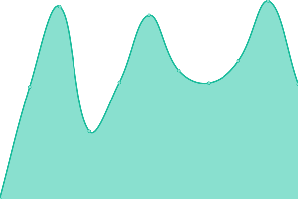

# [📈 Live Status](https://ChungZH.github.io/upptime): <!--live status--> **🟩 All systems operational**

This repository contains the open-source uptime monitor and status page for [Flex Zhong](https://chungzh.cn/), powered by [Upptime](https://github.com/upptime/upptime).

With [Upptime](https://upptime.js.org), you can get your own unlimited and free uptime monitor and status page, powered entirely by a GitHub repository. We use [Issues](https://github.com/ChungZH/upptime/issues) as incident reports, [Actions](https://github.com/ChungZH/upptime/actions) as uptime monitors, and [Pages](https://ChungZH.github.io/upptime) for the status page.

<!--start: status pages-->
<!-- This summary is generated by Upptime (https://github.com/upptime/upptime) -->
<!-- Do not edit this manually, your changes will be overwritten -->

| URL                                       | Status | History                                                                                                        | Response Time                                                                             | Uptime                                                                                                                                                                                                                           |
| ----------------------------------------- | ------ | -------------------------------------------------------------------------------------------------------------- | ----------------------------------------------------------------------------------------- | -------------------------------------------------------------------------------------------------------------------------------------------------------------------------------------------------------------------------------- |
| [ChungZH's portfolio](https://chungzh.cn) | 🟩 Up  | [chung-zh-s-portfolio.yml](https://github.com/ChungZH/upptime/commits/master/history/chung-zh-s-portfolio.yml) |  503ms |  |
| [ChungZH's blog](https://blog.chungzh.cn) | 🟩 Up  | [chung-zh-s-blog.yml](https://github.com/ChungZH/upptime/commits/master/history/chung-zh-s-blog.yml)           |  523ms      |            |
| [EasyHexo](https://easyhexo.com)          | 🟩 Up  | [easy-hexo.yml](https://github.com/ChungZH/upptime/commits/master/history/easy-hexo.yml)                       |  286ms            |                        |
| [HelloGitHub](https://hellogithub.com/)   | 🟩 Up  | [hello-git-hub.yml](https://github.com/ChungZH/upptime/commits/master/history/hello-git-hub.yml)               |  1532ms       |                |

<!--end: status pages-->

[**Visit our status website →**](https://ChungZH.github.io/upptime)

## 📄 License

- Code: [MIT](./LICENSE) © [Flex Zhong](https://chungzh.cn/)
- Data in the `./history` directory: [Open Database License](https://opendatacommons.org/licenses/odbl/1-0/)
